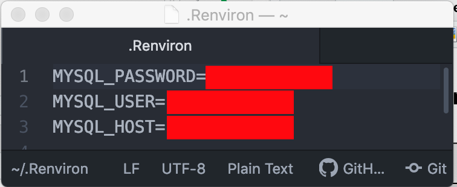

```{r setup, include=FALSE}
knitr::opts_chunk$set(echo = TRUE)
```

Source files: [https://github.com/djlofland/DATA607_F2019/tree/master/Homework2](https://github.com/djlofland/DATA607_F2019/tree/master/Homework2)

# Instructions

## Assignment

> Choose six recent popular movies. Ask at least five people that you know (friends, family, classmates, imaginary friends) to rate each of these movie that they have seen on a scale of 1 to 5. Take the results (observations) and store them in a SQL database. Load the information into an R dataframe.
> Your deliverables should include your SQL scripts and your R Markdown code, posted to GitHub.
> This is by design a very open ended assignment. A variety of reasonable approaches are acceptable. You can (and should) blank out your SQL password if your solution requires it; otherwise, full credit requires that your code is “reproducible,” with the assumption that I have the same database server and R software.

## Survey Link 

This is the survey I shared with friends and family.  I created it with SurveyMonkey and shared the link via FB, email , Slack and text.

[https://www.surveymonkey.com/r/CJLZBRL](https://www.surveymonkey.com/r/CJLZBRL)

# Setup Project

## Load Libraries 

```{r libraries, warning=FALSE, results='hide'}
library(formattable) # Format output options: percent()
library(lubridate)   # Date types and processing
library(tidyverse)   # Tidyverse
library(RMySQL)      # Older MysQL library (note: I could NOT get the RMariaDB lib to work)
library(ggmosaic)    # Mosaic plots in ggplot2: geom_mosaic
library(gridExtra)   # Layout plots
```

## Helper function to load SQL

```{r}
getSQL <- function(filepath) {
  con = file(filepath, "r")
  sql.string <- ""

  while (TRUE) {
    line <- readLines(con, n = 1)

    if ( length(line) == 0 ) {
      break
    }

    sql.string <- paste(sql.string, line)
  }

  close(con)
  return(sql.string)
}
```

## Setup of .Renvron variables

> To prevent sensitive information from being exposed, I created a file called .Renviron in my home directory.  RStudio will read this file and load system environment variables.  We can then just use **Sys.getenv("VAR_NAME")** to reference the value without exposing it.



# Load Survey Data to DB

## Connect to DB

```{r database}
# Connect to our MySQL DB
con <- dbConnect(RMySQL::MySQL(), user=Sys.getenv("MYSQL_USER"), password=Sys.getenv("MYSQL_PASSWORD"), host=Sys.getenv("MYSQL_HOST"))

# Attempt to connect to movie_reviews DB, Create it if it's missing
result = tryCatch({
    res <- dbSendQuery(con, 'USE movie_reviews;')
}, error = function(e) {
    res <- dbSendQuery(con, 'CREATE DATABASE movie_reviews;')
})
```

## Create DB tables

Source: [sql/movies.sql](sql/movies.sql), [sql/options.sql](sql/options.sql), [sql/responses.sql](sql/responses.sql), [sql/ages.sql](sql/ages.sql)

```{r tables, results='hide'}
# Create the movies table and load movies
movies_sql <- getSQL('sql/movies.sql')
dbSendQuery(con, movies_sql)

# Create the options table and load options
options_sql <- getSQL('sql/options.sql')
dbSendQuery(con, options_sql)

# Create the responses table (note we will load data from csv in later step)
responses_sql <- getSQL('sql/responses.sql')
dbSendQuery(con, responses_sql)

# Create the ages table (note we will load data from csv in later step)
ages_sql <- getSQL('sql/ages.sql')
dbSendQuery(con, ages_sql)
```

## Load movies, options, ages

```{r}
# Load the list of allowed options respondants could choose when ranking each movie
sql <- "SELECT Response FROM options ORDER BY ID;"
res <- dbSendQuery(con, sql)

response_options <- dbFetch(res)
response_options$Response

# Load the list of movies (we need this to map MovieName's and MovieID's)
sql <- "SELECT MovieID, MovieName FROM movies;"
res <- dbSendQuery(con, sql)

movie_options <- dbFetch(res)
movie_options

# Load the list of movies (we need this to map MovieName's and MovieID's)
sql <- "SELECT AgeBucket FROM ages ORDER BY ID;"
res <- dbSendQuery(con, sql)

age_options <- dbFetch(res)
age_options$AgeBucket

# Remove existing responses - we will repopulate from CSV
sql <- "TRUNCATE TABLE responses;"
res <- dbSendQuery(con, sql)
```

## Load SurveyMonkey CSV file

```{r}
# Load the raw CSV exported by SurveyMonkey
survey <- read_csv('data/Rate Recent Movies.csv')

# Let' set base column names (that are R safe)
names(survey) <- c('RespondentID', 'CollectorID', 'StartDate', 'EndDate', 'IPAddress', 'EmailAddress', 'FirstName', 'LastName', 'CustomData1', 'SpidermanFarFromHome', 'HobbsAndShaw', 'LionKing2019', 'AnnabelleComeHome', 'ToyStory4', 'MetersDown47', 'Gender', 'Age')
```

## Cleanup CSV data-prep for DB

```{r}
# Remove a few unnecessary columns
survey <- survey %>% select(-IPAddress, -EmailAddress, -FirstName, -LastName, -CustomData1)
survey <- survey[2:nrow(survey),]

survey

# Convert the two date columns from charater to date objects (using lubridate library)
survey$StartDate <- dmy_hms(survey$StartDate)
survey$EndDate <- dmy_hms(survey$EndDate)

# Cache the processed CSV 
write_delim(survey, 'data/processed_movies.csv', delim = ", ", na = "NA", append = FALSE, quote_escape = "double")
```

## INSERT responses into DB

```{r pressure, echo=TRUE}

#  Loop thru survey response rows and build SQL INSERT rows for each
rows <- ''
for (x in 1:nrow(survey)) {
  row_data <- paste(t(survey[x,]), collapse='","')
  rows <- paste(rows, sprintf('("%s"),',row_data))
}

# Run our INSERT statement to load the DB table
query <- paste("INSERT INTO responses VALUES", rows)
query <- substr(query, 1, str_length(query)-1)

res <- dbSendQuery(con, query)
data <- dbFetch(res)

# Cache off our SQL statement in case we need to troubleshoot
write(query, 'sql/insert_data.sql')
```

# Load Data for Analaysis

## Read responses from DB

```{r}
# Load the list of movies (we need this to map MovieName's and MovieID's)
sql <- "SELECT * FROM responses;"
res <- dbSendQuery(con, sql)

survey <- as_tibble((dbFetch(res)))
survey
```

## Clean up Columns

```{r}
# Fix column datatypes
survey$RespondentID <- as.character(survey$RespondentID)
survey$CollectorID <- factor(survey$CollectorID)
survey$StartDate <- ymd_hms(survey$StartDate)
survey$EndDate <- ymd_hms(survey$EndDate)

# Convert our movie review ranks into an ordinal factor
survey$SpidermanFarFromHome <- factor(survey$SpidermanFarFromHome, levels=response_options$Response, ordered=TRUE)
survey$HobbsAndShaw <- factor(survey$HobbsAndShaw, levels=response_options$Response, ordered=TRUE)
survey$LionKing2019 <- factor(survey$LionKing2019, levels=response_options$Response, ordered=TRUE)
survey$AnnabelleComeHome <- factor(survey$AnnabelleComeHome, levels=response_options$Response, ordered=TRUE)
survey$ToyStory4 <- factor(survey$ToyStory4, levels=response_options$Response, ordered=TRUE)
survey$MetersDown47 <- factor(survey$MetersDown47, levels=response_options$Response, ordered=TRUE)
survey$Gender <- factor(survey$Gender)

# Convert our ages (charater) into an ordinal factor
survey$Age <- factor(survey$Age, levels=age_options$AgeBucket, ordered=TRUE)

survey
```

# Analysis

## Calculated Columns

```{r}
# Get the total movies reported seen per person
survey <- survey %>% 
  mutate(MovieCount = purrr::pmap_dbl(list(SpidermanFarFromHome != "I didn't see it", 
                                           HobbsAndShaw != "I didn't see it",
                                           LionKing2019 != "I didn't see it",
                                           AnnabelleComeHome != "I didn't see it",
                                           ToyStory4 != "I didn't see it",
                                           MetersDown47 != "I didn't see it"
                                           ), sum))

# Simple boolean to filter people who haven't seen any movies
survey$hasSeenAny <- (survey$MovieCount > 0)
survey$hasSeenAny
```

### Color Palletes

```{r}
palette_TF <- c("#9bb645", "#ead4cb")
palette_MF <- c("#D15A48", "#548E88")
palette_Ages <- scale_fill_brewer(palette="Blues")
```

## Responses

```{r}
table(survey$Gender)
table(survey$Age)
density(table(survey$Age))
```

## Plots


### Seen Any Movies: Gender, Age

```{r}
survey$hasSeenAny <- factor(survey$hasSeenAny, levels=c(TRUE,FALSE))
# Seen any by Gender
table(survey$hasSeenAny, survey$Gender)
prop.table(table(survey$hasSeenAny, survey$Gender))

p1 <- ggplot(data=survey) + 
  geom_mosaic(aes(x = product(Gender), fill=hasSeenAny), na.rm=TRUE) +
  scale_fill_manual(values=palette_TF) + 
  labs(x="Gender", y="Has Seen Any Movies", title='Seen Any Movies by Gender') + 
  theme(plot.title = element_text(hjust = 0.5))

# Seen any by Age Bucket
prop.table(table(survey$hasSeenAny, survey$Age))

p2 <- ggplot(data=survey) + 
  geom_mosaic(aes(x = product(Age), fill=hasSeenAny), na.rm=TRUE) +
  scale_fill_manual(values=palette_TF) + 
  labs(x="Age", y="Has Seen Any Movies", title='Seen Any Movies by Age') + 
  theme(plot.title = element_text(hjust = 0.5), axis.text.x = element_text(angle = 90, hjust = 1))

grid.arrange(p1, p2, nrow = 1)
```

### Total Movies Seen

```{r}
# Filter to only include people who have seen 1+ movies
survey_viewers <- subset(survey, hasSeenAny == TRUE)

# Movies by Gender
table(survey_viewers$MovieCount, survey_viewers$Age)
prop.table(table(survey_viewers$MovieCount, survey_viewers$Age))

p3 <- ggplot(data=survey_viewers, aes(x=MovieCount, fill=Age)) + 
  geom_bar(stat="count", width=0.7, position=position_dodge()) +
  palette_Ages +
  theme(plot.title = element_text(hjust = 0.5)) +
  labs(x="Movies Seen", y="Respondants", title='Movie Count by Age')

# Movies by Gender
table(survey_viewers$MovieCount, survey_viewers$Gender)
prop.table(table(survey_viewers$MovieCount, survey_viewers$Gender))

p4 <- ggplot(data=survey_viewers, aes(x=MovieCount, fill=Gender)) + 
  geom_bar(stat="count", width=0.7, position=position_dodge()) +
  scale_fill_manual(values=palette_MF) + 
  theme(plot.title = element_text(hjust = 0.5)) +
  labs(x="Movies Seen", y="Respondants", title='Movie Count by Gender')

grid.arrange(p3, p4, nrow = 1)
```

### Responses by Age

```{r}
p5 <- ggplot(data=survey, aes(x=Age, y=MovieCount, fill=Gender)) +
  geom_boxplot() +
  scale_fill_manual(values=palette_MF) + 
  theme(plot.title = element_text(hjust = 0.5), axis.text.x = element_text(angle = 90, hjust = 1)) +
  labs(x="Movies Seen", y="Respondants", title='Movie Count by Age (All)')

p6 <- ggplot(data=survey_viewers, aes(x=Age, y=MovieCount, fill=Gender)) +
  geom_boxplot() +
  scale_fill_manual(values=palette_MF) + 
  theme(plot.title = element_text(hjust = 0.5), axis.text.x = element_text(angle = 90, hjust = 1)) +
  labs(x="Movies Seen", y="Respondants", title='Movie Count by Age (Only Viewers)')

grid.arrange(p5, p6, nrow = 1)
```

### Ranking by Movie

```{r fig.width=10, fig.height=14 }
# Loop thru each movie and plot the response segmented by gender
plist <- lapply(movie_options$MovieID, function(col) {
  ggplot(data=survey, aes_string(x=col, fill="Gender")) + 
    geom_bar(stat="count", width=0.7, position=position_dodge()) +
    scale_fill_manual(values=palette_MF) + 
    theme(plot.title = element_text(hjust = 0.5), axis.text.x = element_text(angle = -45, hjust = 1)) +
    labs(x="Movies Seen", y="Respondants", 
         title=movie_options$MovieName[movie_options$MovieID==col])
})

ml <- marrangeGrob(plist, nrow=3, ncol=2)
ml
```


# Conclusions

- My Survey doesn't generalize at all.  Respondents were my friends & family.  They self-selected to taking the survey.  The movie selection was chosen by me.  So all bets are off.
- Within my sample, there were so few subjects and so few movie choices, that I wouldn't draw any significance of findings.
- **11 Men** responded and **10 Women** responded
- The distribution of respondants *age ranges* was normally distributed with the Mean and Median at **35-44 years old** 
- Within my sample, **more men reported seeing movies than women**.
- Most ages reported seeing at least one movie, at similar rates.  The exception was *age range* 65+, who reported seeing no movies in the survey.
- Most respondants saw **2~3 movies** with one Man seeing 6 and one Woman seeing 4.

## Future Questions

- Do movie ranks correlate with Gender?
- Do movie ranks correlate with Age?

## Other Comments

- For this project, I chose not to implement a Cloud DB.  I use Cloud DB services all the time (Snowflake Computing and AWS Aurora) so prefered to spend my time learning other aspects of R.
- My Project will build the local MySQL DB & tables, then populate the DB tables from the CSV from SurveyMonkey.  In a real project, rather than rebuild everytime, I would check if the data is populated and if so, skip over the loading step and go right to the analysis work.
